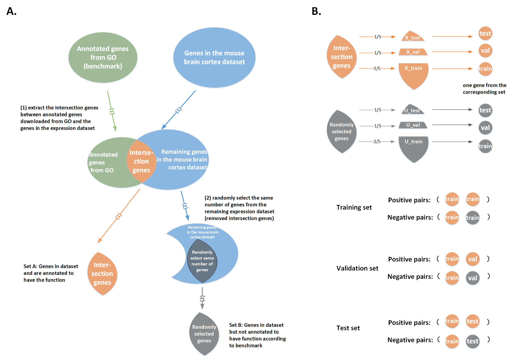

## Training, validation, and test sets generation for gene functional annotation

### To generate the gene pairs of training, validation, and test sets
**output files**
* XXXX_gene_pairs_train.txt
* XXXX_gene_pairs_val.txt
* XXXX_gene_pairs_test.txt
* XXXX_count_set_test.txt
* XXXX_known_gene.npy
* XXXX_unknown_gene.npy

